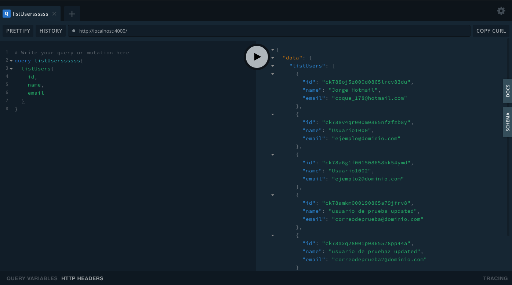
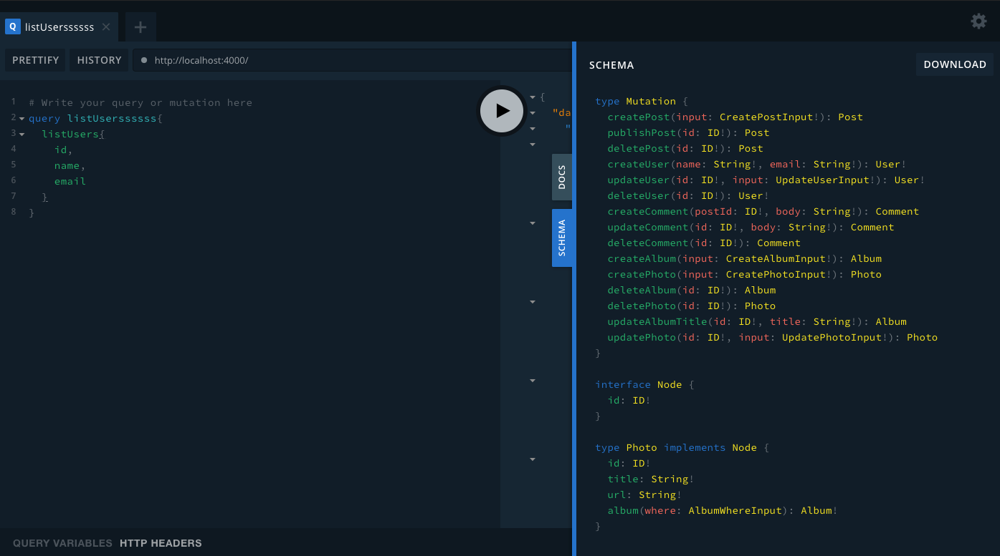
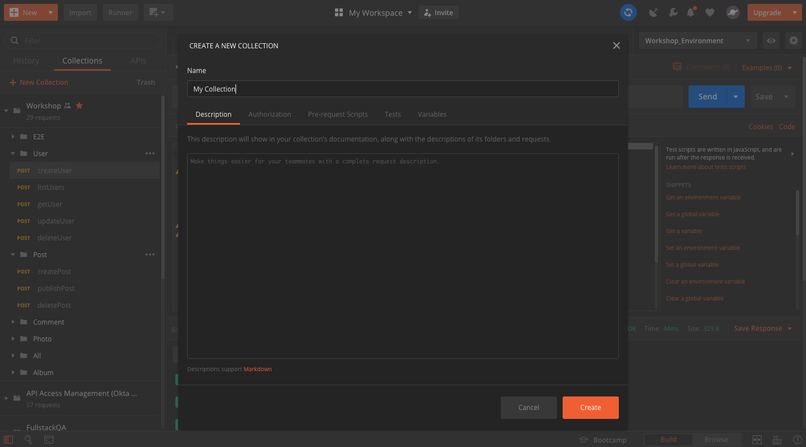

## Let's Automate a GraphQL API

---

### Postman + Graphql


---

### Let's meet playground




---

### GraphQL Schema




---

### Set Environment




---?color=linear-gradient(90deg, #5384AD 65%, white 35%)
@title[Add A Little Imagination]

@snap[north-west h4-white]
#### What do we want to do?
@snapend

@snap[west span-55]
@ul[list-spaced-bullets text-white text-09]
- Create a user
- List all users
- Get a single user
- Update a user
- And **Delete a user**
@ulend
@snapend

@snap[east span-45]
@img[shadow](assets/img/conference.png)
@snapend

---

## Let's work with a mutation!

---

@snap[north-east span-100 text-pink text-06]
Creating a new user.
@snapend

```javascript zoom-18
mutation createUser($name:String!,$email:String!){
    createUser(name:$name,email:$email){
        id
        email
        name
        username
        company
    }
}
```

@snap[south span-100 text-gray text-08]
@[1](Here we are defining a mutation with the name createUser and we are sending two parameters)
@[2, zoom-13](Notice that in this line we are using the previous parameters)
@[3-7, zoom-12](These are the fields we want to receive in the response body)
@snapend

---

## Let's work with a query

---

@snap[north-east span-100 text-pink text-06]
List all users.
@snapend

```javascript zoom-18
query listUsers{
  listUsers{
    id,
    name,
    email
  }
}
```

@snap[south span-100 text-gray text-08]
@[1](Here we are defining a query with the name listUsers)
@[2, zoom-13](This is the available query in the schema of the graphql service)
@[3-5, zoom-12](These are the fields we want to receive in the response body)
@snapend

---

## Let's inspect a new query!

---

@snap[north-east span-100 text-pink text-06]
Get an specific user.
@snapend

```javascript zoom-18
query getUser($id: ID!){
  getUser(id:$id){
    id,
    name,
    email,
    username,
    posts{
        id,
        title,
        content,
        published
    }
  }
}
```

@snap[south span-100 text-gray text-08]
@[1](Here we are defining a query with the name getUser and we are sending an ID parameter)
@[2, zoom-13](On this line we are sending the parameter we defined previously)
@[3-7, zoom-12](These are the fields we want to receive in the response body)
@[7-12, zoom-12](On this line observe that we are making another consult at the same time, thanks to graphql!)
@snapend


---

## Let's update a user!

---


@snap[north-east span-100 text-pink text-06]
Trying to update an existing user.
@snapend

```javascript zoom-18
mutation updUser($input:UpdateUserInput!){
    updateUser(id:$id,input:$input){
        id,
        email,
        username,
        name,
        company,
        gender
  }
}
```

@snap[south span-100 text-gray text-08]
@[1](This is a mutation with the name updUser and we are sending an Input parameter)
@[2, zoom-13](On this line we are sending two parameters that we defined previously)
@[3-8, zoom-12](Again, these are the fields we want to receive in the response body)
@snapend


---

## Let's delete a user!

---

@snap[north-east span-100 text-pink text-06]
Deleting the last user created.
@snapend

```javascript zoom-18
mutation deleteUser {
    deleteUser(id:"{{id_user}}"){
        id,
        name,
        email
    }
}
```

@snap[south span-100 text-gray text-08]
@[1](Here we are defining a mutation with the name deleteUser and we don't need any parameters)
@[2, zoom-13](On this line we are sending two parameters that we defined previously)
@[3-8, zoom-12](Again, these are the fields we want to receive in the response body)
@snapend


---?image=assets/img/presenter.jpg

@snap[north span-100 h2-white]
## Now It's Your Turn
@snapend

@snap[south span-100 text-06]
### Try to create an automated flow for Post
@snapend
